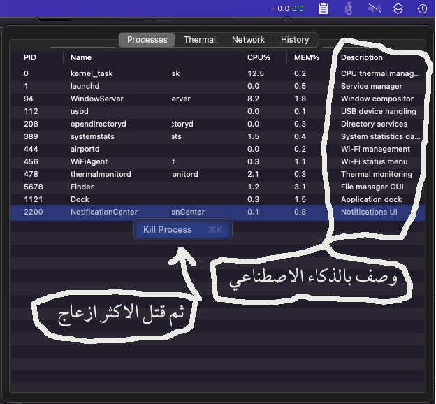

# Mac Monitor

macOS process monitor with AI-powered descriptions using Groq API (free).
Now evolving into a native **Swift status bar app** for macOS 10.15+.

## Features (Python CLI)

- Instant process snapshot via `ps -A`
- Three-section layout: USER_APPS / BACKGROUND / SYSTEM_CORE
- AI-powered descriptions via Groq (free tier: 14,400 req/day)
- Multi-level fallback chain for reliability
- Kill processes directly from the TUI
- SQLite cache for instant repeat lookups
- Zero flicker (ANSI control codes, no `os.system('clear')`)
- Static snapshot (IDs don't change during refresh)

## Description Resolution Chain

When looking up a process description, the tool tries each source in order:

1. **SQLite cache** (instant) — previously resolved descriptions
2. **Hardcoded overrides** (instant) — fixes known AI hallucinations (e.g., Code Helper → Xcode)
3. **whatis** (local, macOS daemons) — system's built-in manual page database
4. **Path extraction** (local, `.app` bundles) — extracts app name from bundle path
5. **Groq AI** (cloud, rate-limited) — llama-3.1-8b-instant, free tier 14,400 req/day
6. **Generic fallback** — "macOS process: {name}"

## Swift Status Bar App (In Development)

Native macOS menu bar application being built alongside the Python CLI.
Targets **macOS 10.15 Catalina** (compatible with older Intel Macs).



### Current Stage — Phase 1: Basic UI

- NSStatusBar icon with live CPU/mem display
- NSPopover with 4-tab layout (Processes, Thermal, Network, History)
- Process list with PID, Name, CPU%, MEM%, Description columns
- Right-click / double-click to kill a process
- 15 realistic mock processes for UI preview
- Placeholder tabs for Thermal, Network, History (coming in later phases)

### Planned Phases

| Phase | Feature | Status |
|-------|---------|--------|
| 1 | Basic NSStatusBar UI with mock data + tab layout | ✅ Done |
| 2 | Real process snapshot (`proc_pidinfo`, `sysctl`) | ⏳ Next |
| 3 | SMC sensor reads (temps, fans) + Thermal tab | ❌ |
| 4 | Network stats + History chart (SQLite via GRDB) | ❌ |
| 5 | Groq AI batching for process descriptions | ❌ |

### Build (GitHub Actions)

The Swift app requires Xcode 16 / Swift 6 and targets macOS 10.15.
Build on your own Mac with Xcode, or use the CI pipeline:

1. Push to `main` branch → GitHub Actions builds universal binary
2. Download artifact from Actions page
3. Remove quarantine and run:
   ```bash
   xattr -d com.apple.quarantine MacMonitorApp
   ./MacMonitorApp
   ```

## Project Structure

```
mac-monitor-groq/
├── mac_monitor.py               # Python CLI entry point
├── modules/
│   ├── __init__.py
│   ├── config.py                # Settings, overrides, known classes
│   ├── database.py              # SQLite cache
│   ├── snapshot.py              # ps capture
│   ├── classifier.py            # Process categorization
│   ├── descriptions.py          # Resolution chain
│   ├── groq_provider.py         # Groq API client
│   └── ui.py                    # Terminal UI (ANSI)
├── MacMonitorApp/               # Swift status bar app
│   ├── Package.swift
│   └── Sources/MacMonitorApp/
│       ├── main.swift           # Entry point, `.accessory` policy
│       ├── StatusBar/
│       │   ├── StatusBarController.swift  # NSStatusItem + NSPopover
│       │   └── StatusBarIcon.swift        # Attributed string icon
│       └── Views/
│           ├── PopoverContentView.swift   # 4-tab NSTabView layout
│           ├── ProcessTableView.swift     # NSTableView with kill
│           ├── ThermalView.swift          # SMC sensors placeholder
│           ├── NetworkView.swift          # Network stats placeholder
│           └── HistoryChartView.swift     # SQLite history placeholder
├── .github/workflows/
│   └── macos_compiler.yml       # Universal binary CI pipeline
├── requirements.txt
├── .env.example
└── README.md
```

## Cache (Python CLI)

Database is stored at `~/.mac-monitor-groq/process_cache.db`. It preserves descriptions between runs so previously resolved processes appear instantly on subsequent launches.

## Requirements

- Python 3.8+ (for CLI version)
- macOS 10.15+ (for Swift app)
- Groq API key (free, no credit card)
