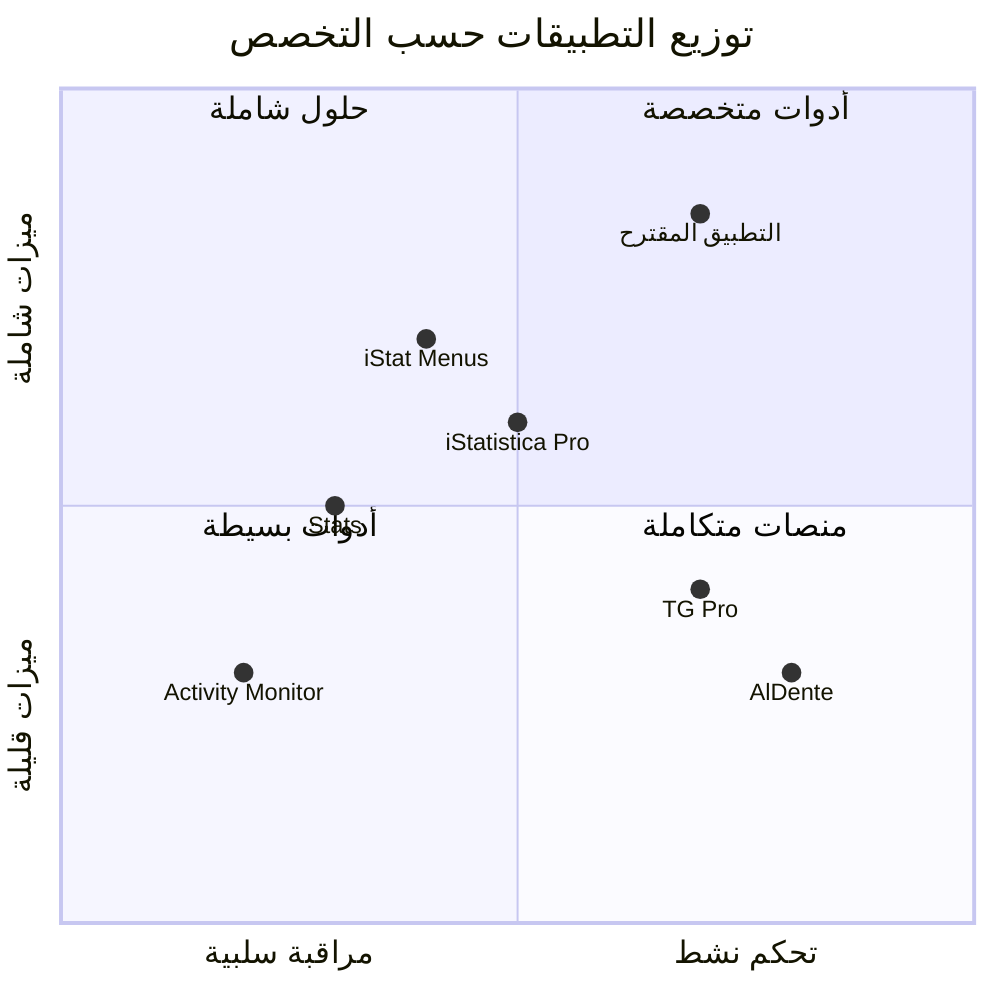

# تحليل المخطط الهندسي — تطبيق مراقبة أنظمة macOS بديل

**تاريخ التحليل:** 10 يونيو 2026  
**المصدر:** دراسة معمارية وميزات ابتكارية لتطوير تطبيق مراقبة الأنظمة البديل على نظام macOS

---

## 1. خلاصة المشهد الحالي

### القصور الهيكلي لأداة Activity Monitor الافتراضية

| المشكلة | التفاصيل | الأثر |
|---------|----------|-------|
| **غياب التجميع الشجري** | لا تجمع العمليات الفرعية تحت العملية الأب | متصفح به 50 عملية يظهر مبعثراً — يستحيل معرفة استهلاكه الإجمالي |
| **لا تتبع لمحرك ANE** | 0 دعم لمراقبة المحرك العصبي | لا يمكن معرفة استهلاك Ollama أو Draw Things |
| **بيانات GPU VRAM ناقصة** | لا تظهر VRAM لكل عملية | تحليل استخدام GPU بدقة مستحيل |
| **لا سجل تاريخي** | بيانات لحظية فقط، تُفقد عند الإغلاق | لا يمكن تتبع تسريبات الذاكرة طويلة المدى |
| **لا مؤشرات تآكل SSD** | لا مؤشرات عن عمر الخلايا | خطر — تلف SSD الملحوم = تلف الجهاز بالكامل |

---

## 2. التحليل التنافسي — الفجوات السوقية

### توزيع الميزات على التطبيقات الحالية



### أبرز الفجوات التي لا يسدها أي تطبيق منفرد

1. **ANE/NPU Tracking** — لا يدعمه أي تطبيق تجاري بشكل موثوق
2. **Process Tree Aggregation** — غائب عن الجميع تماماً (بما فيهم iStat Menus)
3. **Per-App Volume Control** — غير موجود في أي تطبيق مراقبة
4. **Battery Calibration + Fan Curves + Remote API** في تطبيق واحد — غير متوفر تجارياً

### نموذج التسعير المقترح (Freemium)

```
┌─────────────────────────────────────────────────────┐
│                  مجاناً (Core Engine)                │
│  CPU / Memory / Network / Disk monitoring           │
│  Menu bar live stats                                │
│  Process list with basic filtering                  │
├─────────────────────────────────────────────────────┤
│         ترقية احترافية (15-25$، شراء لمرة واحدة)     │
│  Fan control + custom curves                        │
│  Battery charge limiter + Sailing Mode + Calibration │
│  ANE usage monitoring                               │
│  Historical SQLite database                         │
│  REST API + Remote web dashboard                    │
│  Process tree view + Smart Kill                     │
│  Per-app volume control                             │
│  Advanced automation rules                          │
└─────────────────────────────────────────────────────┘
```

---

## 3. المعمارية التقنية — تحليل آليات القراءة والتحكم

### 3.1 SMC والتحكم بالمراوح

**البنية ثنائية الأجزاء:**

```
┌──────────────────────┐      XPC (آمن)      ┌──────────────────────────┐
│  Main App (User)     │ ◄──────────────────► │  Privileged Helper Tool  │
│  SwiftUI MenuBarExtra │                     │  (Root, no Sandbox)      │
│  واجهة المستخدم       │                     │  وصول مباشر لـ SMC       │
└──────────────────────┘                     └──────────────────────────┘
                                                      │
                                                      ▼
                                               ┌──────────────┐
                                               │    IOKit     │
                                               │   SMC Keys   │
                                               └──────────────┘
```

**المفاتيح الأساسية للـ SMC:**

| المفتاح | الوظيفة | النوع |
|---------|---------|-------|
| `TC0P` | حرارة المعالج المركزي | قراءة |
| `TCXC` | حرارة أنوية المعالج | قراءة |
| `TGDD` | حرارة وحدة معالجة الرسوميات | قراءة |
| `Tp09` | حرارة شريحة SoC | قراءة |
| `F0Ac` | سرعة المروحة الحالية (RPM) | قراءة |
| `F0Tg` | السرعة المستهدفة للمروحة | كتابة |
| `F0Md` | وضع التحكم (0=تلقائي, 1=يدوي) | كتابة |
| `FS!` | قفل/تجاوز التحكم الافتراضي | كتابة |

**⚠️ تنبيه أمان — Watchdog:**
يجب أن يعيد الـ Helper Tool التحكم تلقائياً إلى الوضع التلقائي إذا انهار التطبيق الرئيسي، وإلا قد ترتفع حرارة المكونات.

### 3.2 ضغط الذاكرة (Memory Pressure)

**مستويات ضغط الذاكرة عبر `kern.memorystatus_vm_pressure_level`:**

| القيمة | الحالة | اللون |
|--------|--------|-------|
| `1` | NORMAL — طبيعي | 🟢 أخضر |
| `2` | WARN — تحذير، بدأ الضغط | 🟡 أصفر |
| `4` | CRITICAL — خطر، استخدام Swap مكثف | 🔴 أحمر |

**ملاحظة جوهرية لمعالجات Apple Silicon:**
سرعة Swap عالية جداً بفضل الذاكرة الموحدة → لا يشعر المستخدم بالبطء حتى في الضغط العالي → الحاجة لمعيار أدق من مجرد "لون" الضغط.

### 3.3 تأثير الطاقة (Energy Impact)

**المعادلة الأساسية:**

```
Energy Impact = CPU% + (IDLEW × 0.0005)
```

حيث `IDLEW` = عدد التنبيهات التي توقظ النواة من وضع الخمول.

**مفارقة:** تطبيق قد يستهلك CPU% ≈ 0% لكن طاقته > 150 بسبب آلاف التنبيهات اللحظية.

**خدمات الخلفية المسؤولة:**
- `systemstats` — تتبع سلوك وتاريخ العمليات
- `powermetrics` — قياس استهلاك الطاقة على مستوى الشريحة

### 3.4 تتبع محرك ANE

**المشكلة:** لا يوجد عداد نسبة مئوية صلب للـ ANE في النظام.

**الحل — التقدير عبر `IOReport`:**

```
Estimated ANE% = (ANE Power (Watts) / 8.0W) × 100
```

حيث 8.0W هو الحد الأقصى القياسي لاستهلاك المحرك العصبي في معالجات Apple Silicon.

**القيود:**
- قراءات مجمعة على مستوى الشريحة، وليس لكل عملية
- يستحيل تحديد أي PID يستهلك الـ ANE
- الوصول عبر `IOReport` غير موثق وقد يتغير

**عكس الهندسة — Orion & maderix:**
- نجح باحثون في الوصول للـ ANE مباشرة عبر `AppleNeuralEngine.framework`
- يتجاوز CoreML بالكامل
- يسمح بتدريب الشبكات الصغيرة محلياً على ANE

### 3.5 قراءة العمليات وال شبكة

**قراءة العمليات بلغة Swift:**

```swift
// 1. sysctl مع MIB للعمليات الكلية → مصفوفة kinfo_proc
// 2. استعلام ثانوي KERN_PROCARGS2 → مسار التشغيل + الوسائط
```

**تتبع الشبكة — خياران:**
1. `nettop` — تشغيله كعملية خلفية وقراءة مخرجاته دورياً (قائمة بكل عملية وبياناتها المرسلة/المستلمة)
2. `netstat -I en0` — قراءة التدفق العام للواجهة النشطة (بايت واردة/صادرة، أخطاء)

---

## 4. الميزات الابتكارية — التحليل والأولوية

### مصفوفة الأولوية (Impact × Effort)

| الميزة | الأثر | الجهد | الأولوية |
|--------|-------|-------|----------|
| Process Tree View | 🔥 عالي | 🟢 منخفض | **1** |
| Historical SQLite DB | 🔥 عالي | 🟢 منخفض | **2** |
| Sort by CPU/MEM | 🔥 عالي | 🟢 منخفض | **3** |
| Batch Groq Descriptions | 🔥 عالي | 🟢 منخفض | **4** |
| REST API + Remote Dashboard | 🔥 عالي | 🟡 متوسط | **5** |
| Smart Kill (tree + children) | 🟡 متوسط | 🟢 منخفض | **6** |
| ANE Monitoring | 🔥 عالي | 🔴 عالي | **7** |
| Fan Control + Curves | 🟡 متوسط | 🔴 عالي | **8** |
| Battery Charge Limiter | 🟡 متوسط | 🔴 عالي | **9** |
| Per-App Volume Control | 🟢 نادر | 🔴 عالي | **10** |

### التفاصيل التقنية للميزات الرئيسية

#### 4.1 محرك هيكلة العمليات (Process Tree)
- قراءة `ppid` من `kinfo_proc`
- بناء شجرة: `parent → [child1, child2, ...]`
- تجميع `cpu%`, `mem%` للأطفال تحت الأب
- عرض تفاعلي: شجرة قابلة للطي

#### 4.2 قاعدة البيانات التاريخية (SQLite)
```
جدول: process_snapshots
├── timestamp (ISO 8601)
├── pid
├── name
├── cpu_percent
├── mem_percent
├── energy_impact
├── ane_estimate (nullable)
├── network_sent_bytes
├── network_recv_bytes
├── disk_read_bytes
├── disk_write_bytes
└── category (USER_APP / BACKGROUND / SYSTEM)

جدول: thermal_log
├── timestamp
├── cpu_temp
├── gpu_temp
├── soc_temp
├── fan_speed_rpm
└── fan_mode (auto/manual)
```

#### 4.3 REST API (خادم ويب محلي)
```
GET  /api/v1/processes          ← قائمة العمليات النشطة
GET  /api/v1/processes/:pid     ← تفاصيل عملية محددة
GET  /api/v1/thermal            ← القراءات الحرارية
GET  /api/v1/history?from=&to=  ← بيانات تاريخية
GET  /api/v1/stats              ← إحصائيات النظام الكلية
POST /api/v1/kill/:pid          ← إنهاء عملية
```

أمان: تصفية حسب IP + Passkey مشفر.

---

## 5. دليل التطوير — الاعتبارات الهندسية

### 5.1 هيكل تطبيق SwiftUI مع MenuBarExtra

```swift
@main
struct MacMonitorApp: App {
    @AppStorage("showMonitorExtra") private var showMonitorExtra = true

    var body: some Scene {
        MenuBarExtra(isInserted: $showMonitorExtra) {
            MainDashboardView()
                .frame(width: 340, height: 480)
        } label: {
            HStack(spacing: 4) {
                Image(systemName: "cpu")
                Text("\(temperature)°C")
                    .font(.system(.body, design: .monospaced))
            }
        }
        .menuBarExtraStyle(.window)
    }
}
```

**Info.plist — إخفاء من Dock:**
```xml
<key>LSUIElement</key>
<true/>
```

### 5.2 التحديات الهندسية والحلول

| التحدي | الحل |
|--------|------|
| **Notch يحجب الأيقونات** | خيارات عرض مضغوطة، دمج القراءات في علامة واحدة |
| **استهلاك التطبيق للموارد** | تردد استعلام افتراضي 5 ثوانٍ، بدعم يدوي لتغييره |
| **Helper Daemon يطلب كلمة مرور متكررة** | استخدام `ServiceManagement` للتسجيل الآلي لمرة واحدة |
| **توزيع خارج App Store** | Notarization من Apple لاجتياز Gatekeeper |
| **تغير واجهات SMC بين الأجهزة** | اكتشاف تلقائي للمفاتيح + قاعدة بيانات للأجهزة المدعومة |

### 5.3 استراتيجية التوزيع

```
تطبيق خارج الـ App Store (لعدم دعم Sandbox)
        │
        ▼
Notarization من Apple
        │
        ▼
توزيع عبر GitHub Releases أو موقع رسمي
        │
        ▼
Freemium: واجهة أساسية مجانية + Pro عبر شراء لمرة واحدة
```

---

## 6. ملاحظات استراتيجية

1. **أكبر فجوة سوقية:** Process Tree View + ANE Monitoring — لا يقدمها أي منافس
2. **أسرع مكسب:** Batch Groq API للوصف الفوري للعمليات (ثمنه request واحد فقط)
3. **الخطر الأكبر:** Apple قد "تشرلوك" (Sherlock) الميزات في تحديث macOS قادم
4. **التميز:** الجمع بين المراقبة والتحكم النشط بالعتاد في تطبيق واحد بواجهة عربية
5. **الجمهور المستهدف:** مطورو macOS، مسؤولو الأنظمة، عشاق الأداء، مستخدمو الذكاء الاصطناعي المحلي

---

*تم إنشاء هذا التحليل بناءً على دراسة معمارية شاملة لمتطلبات تطبيق مراقبة أنظمة macOS بديل، مع الاستناد إلى 48 مصدراً تقنياً ومقارنة 6 تطبيقات منافسة.*
